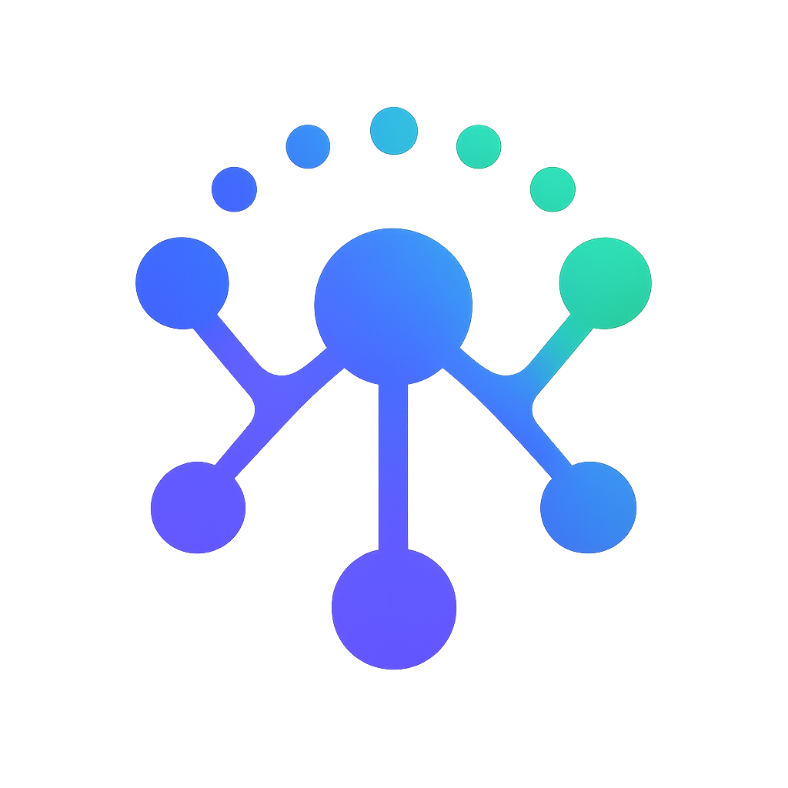
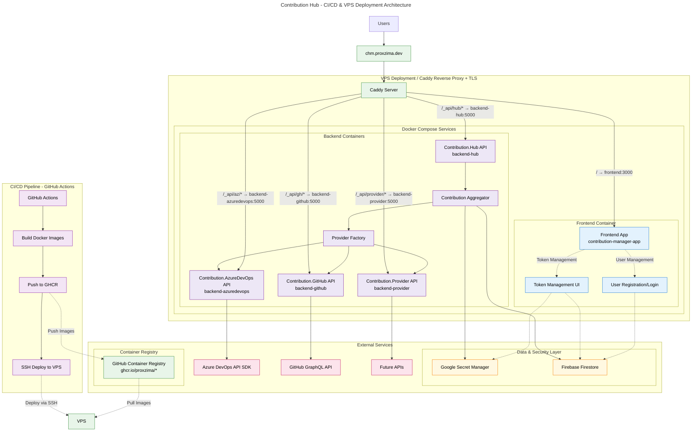

<a id="readme-top"></a>

<div align="center">
  
  <h3>Contribution Hub API</h3>
  <p>
    <strong>A unified API for aggregating developer contributions across multiple platforms</strong>
  </p>

  <p>
    <a href="https://github.com/PROxZIMA/ContributionAPI/actions/workflows/Contribution.Hub.VPS.yaml">
      
    </a>
    <a href="https://github.com/PROxZIMA/ContributionAPI/actions/workflows/Contribution.AzureDevOps.VPS.yaml">
      
    </a>
    <a href="https://github.com/PROxZIMA/ContributionAPI/actions/workflows/Contribution.GitHub.VPS.yaml">
      
    </a>
    <a href="LICENSE">
      
    </a>
    <!-- <a href="https://github.com/PROxZIMA/ContributionAPI/network/members">
      
    </a>
    <a href="https://github.com/PROxZIMA/ContributionAPI/stargazers">
      
    </a> -->
  </p>
</div>

## Table of Contents

- [About The Project](#about-the-project)
- [Architecture](#architecture)
- [Getting Started](#getting-started)
  - [Prerequisites](#prerequisites)
  - [Installation](#installation)
- [Usage](#usage)
  - [Authentication](#authentication)
  - [API Endpoints](#api-endpoints)
- [Roadmap](#roadmap)
- [Contributing](#contributing)
- [License](#license)
- [Contact](#contact)

<p align="right">(<a href="#readme-top">back to top</a>)</p>

## About The Project

ContributionAPI is a powerful microservices-based platform that aggregates developer contributions from multiple sources including GitHub, Azure DevOps, and other development platforms. It provides a unified API interface to retrieve comprehensive contribution data, enabling developers and organizations to get a holistic view of coding activity across different platforms.

<div align="center">
  
</div>

### Key Features

- **Multi-Platform Aggregation**: Seamlessly combines contributions from GitHub, Azure DevOps, and more
- **Microservices Architecture**: Scalable and maintainable service-oriented design
- **Firebase Integration**: Secure user data storage and management
- **Secret Management**: Secure API key and token management
- **Rich Data**: Detailed contribution breakdowns including commits, pull requests, and work items
- **High Performance**: Optimized caching and concurrent data fetching
- **Secure**: Token-based authentication with read-only access patterns

### Built With

* [![ASP.NET Core][aspnet-badge]][aspnet-url]
* [![Firebase Firestore][firebase-badge]][firebase-url]
* [![Google Secret Manager][gsm-badge]][gsm-url]
* [![Azure DevOps SDK][azure-devops-badge]][azure-devops-url]
* [![GitHub API][github-api-badge]][github-api-url]
* [![Oracle OCI][oracle-oci-badge]][oracle-oci-url]
* [![Docker][docker-badge]][docker-url]

<p align="right">(<a href="#readme-top">back to top</a>)</p>

## Architecture

ContributionAPI follows a microservices architecture pattern.

### System Overview



<p align="right">(<a href="#readme-top">back to top</a>)</p>

## Getting Started

Follow these steps to get ContributionAPI running locally.

### Prerequisites

- [.NET 9.0 SDK](https://dotnet.microsoft.com/en-us/download/dotnet/9.0)
- [Git](https://git-scm.com/downloads)
- Firebase project with Firestore enabled (Optional)
- Google Cloud project with Secret Manager enabled (Optional)

### Installation

1. **Clone the repository**
   ```bash
   git clone https://github.com/PROxZIMA/ContributionAPI.git
   cd ContributionAPI
   ```

2. **Set up Firebase credentials** (Optional)
   ```bash
   # Download your Firebase service account key
   # Place it in src/Contribution.Hub/firebase-credentials.json
   ```

3. **Configure Google Cloud credentials** (Optional)
   ```bash
   # Set up Application Default Credentials
   gcloud auth application-default login
   
   # Or set the environment variable
   export GOOGLE_APPLICATION_CREDENTIALS="path/to/your/service-account-key.json"
   ```

4. **Configure application settings** (Optional)
   ```bash
   # Copy and modify configuration files
   cp src/Contribution.Hub/appsettings.Development.json.example src/Contribution.Hub/appsettings.Development.json
   
   # Edit the configuration with your Firebase project details
   ```

5. **Restore dependencies and build**
   ```bash
   dotnet restore
   dotnet build
   ```

6. **Run the services**
   
   **Option A: Run all services together**
   ```bash
   # From VS Code, use the "Run Contribution API" task
   # Or run individually:
   ```
   
   **Option B: Run services individually**
   ```bash
   # Terminal 1 - Hub Service
   cd src/Contribution.Hub
   dotnet run
   
   # Terminal 2 - Azure DevOps Service
   cd src/Contribution.AzureDevOps
   dotnet run
   
   # Terminal 3 - GitHub Service
   cd src/Contribution.GitHub
   dotnet run
   ```

7. **Verify installation**
   ```bash
   curl http://localhost:5298/health
   ```

<p align="right">(<a href="#readme-top">back to top</a>)</p>

## Usage

### Authentication

ContributionAPI uses read-only tokens for secure access to external services.

#### Setting up Read-Only Tokens

**GitHub Personal Access Token:**
1. Go to GitHub Settings → Developer settings → Personal access tokens
    - Or visit https://github.com/settings/tokens/new?scopes=read:user
2. Generate new token (classic) with these scopes:
   - `read:user` (Read ALL user profile data)

**Azure DevOps Personal Access Token:**
1. Go to Azure DevOps → User Settings → Personal access tokens
2. Create new token with these permissions:
   - Code: Read
   - Identity: Read
   - Work Items: Read

### API Endpoints

- Reference: [Contribution Hub Manager](https://chm.proxzima.dev/home#endpoint) for existing endpoints and usage.

For detailed API documentation, visit the Swagger UI at `http://localhost:5298/swagger` when running locally.

<p align="right">(<a href="#readme-top">back to top</a>)</p>

## Roadmap

### Current Version (v1.0)
- [x] GitHub integration
- [x] Azure DevOps integration
- [x] Firebase Firestore data storage
- [x] Google Secret Manager integration
- [x] Basic contribution aggregation
- [x] RESTful API endpoints

### Version 1.1 (Q4 2025)
- [x] Support SVG endpoint for contribution graphs
- [ ] Support PNG endpoint for contribution graphs
- [ ] Add provider specific breakdown
- [x] Set up CI/CD via GitHub Actions to VPS using Docker for hosting

### Version 1.2 (Q1 2026)
- [x] GitLab integration
- [ ] Template for new Providers API
- [ ] Bitbucket integration
- [ ] Advanced analytics and insights
- [ ] GraphQL API support (optional)
- [ ] Persistant caching strategies
    - [x] Key-based caching
    - [x] Serve last cache
    - [ ] Intellignet cache refresh based on usage
    - [ ] Environment based caching configuration

### Version 2.0 (Q2 2026)
- [ ] Real-time contribution streaming
- [ ] Machine learning-powered insights
- [ ] Team and organization support
- [ ] Advanced reporting and dashboards
- [ ] Plugin architecture for custom providers

### Future Considerations
- [ ] Jira integration
- [ ] Stack Overflow integration
- [ ] LinkedIn integration
- [ ] Custom provider framework
- [ ] Enterprise SSO support

See our [Issues](https://github.com/PROxZIMA/ContributionAPI/issues) page to request features or report bugs.

<p align="right">(<a href="#readme-top">back to top</a>)</p>

## Contributing

We welcome contributions from the community! ContributionAPI is an open-source project, and we appreciate any help to make it better.

Please read [CONTRIBUTING.md](CONTRIBUTING.md) for detailed guidelines.

### Code of Conduct

This project follows our [Code of Conduct](CODE_OF_CONDUCT.md). By participating, you agree to uphold this code.

## License

Distributed under the MIT License. See [LICENSE](LICENSE) for more information.

## Acknowledgement

- [grubersjoe/react-github-calendar](https://github.com/grubersjoe/react-github-calendar)
- [grubersjoe/github-contributions-api](https://github.com/grubersjoe/github-contributions-api)

## Contact

### Project Maintainer
**PROxZIMA** - [@PROxZIMA](https://github.com/PROxZIMA)

### Project Links
- **Project Repository**: [https://github.com/PROxZIMA/ContributionAPI](https://github.com/PROxZIMA/ContributionAPI)
- **Issue Tracker**: [https://github.com/PROxZIMA/ContributionAPI/issues](https://github.com/PROxZIMA/ContributionAPI/issues)

### Support

- **Discussions**: Use [GitHub Discussions](https://github.com/PROxZIMA/ContributionAPI/discussions) for community support
- **Bug Reports**: Use our [issue templates](.github/ISSUE_TEMPLATE/) for bug reports
- **Feature Requests**: Submit feature requests through GitHub Issues

<p align="right">(<a href="#readme-top">back to top</a>)</p>


<div align="center">
  <p>Built with ❤️ by <a href="https://github.com/PROxZIMA">PROxZIMA</a></p>
  <p>⭐ Star this repo if you find it helpful!</p>
</div>

[aspnet-badge]: https://img.shields.io/badge/ASP.NET_Core-9.0-512BD4?style=for-the-badge&logo=dotnet&logoColor=white
[aspnet-url]: https://docs.microsoft.com/en-us/aspnet/core/
[firebase-badge]: https://img.shields.io/badge/Firebase_Firestore-Database-FFCA28?style=for-the-badge&logo=firebase&logoColor=white
[firebase-url]: https://firebase.google.com/products/firestore
[gsm-badge]: https://img.shields.io/badge/Google_Secret_Manager-Security-4285F4?style=for-the-badge&logo=googlecloud&logoColor=white
[gsm-url]: https://cloud.google.com/secret-manager
[azure-devops-badge]: https://img.shields.io/badge/Azure_DevOps-REST_SDK-0078D7?style=for-the-badge&logo=data:image/svg%2bxml;base64,PHN2ZyB4bWxucz0iaHR0cDovL3d3dy53My5vcmcvMjAwMC9zdmciIHZpZXdCb3g9IjAgMCAxOCAxOCI+PGRlZnM+PGxpbmVhckdyYWRpZW50IGlkPSJhIiB4MT0iOSIgeTE9IjE2Ljk3IiB4Mj0iOSIgeTI9IjEuMDMiIGdyYWRpZW50VW5pdHM9InVzZXJTcGFjZU9uVXNlIj48c3RvcCBvZmZzZXQ9IjAiIHN0b3AtY29sb3I9IiNmZmYiLz48c3RvcCBvZmZzZXQ9Ii4xNiIgc3RvcC1jb2xvcj0iI2ZmZiIvPjxzdG9wIG9mZnNldD0iLjUzIiBzdG9wLWNvbG9yPSIjZmZmIi8+PHN0b3Agb2Zmc2V0PSIuODIiIHN0b3AtY29sb3I9IiNmZmYiLz48c3RvcCBvZmZzZXQ9IjEiIHN0b3AtY29sb3I9IiNmZmYiLz48L2xpbmVhckdyYWRpZW50PjwvZGVmcz48cGF0aCBkPSJNMTcgNHY5Ljc0bC00IDMuMjgtNi4yLTIuMjZWMTdsLTMuNTEtNC41OSAxMC4yMy44VjQuNDR6bS0zLjQxLjQ5TDcuODUgMXYyLjI5TDIuNTggNC44NCAxIDYuODd2NC42MWwyLjI2IDFWNi41N3oiIGZpbGw9InVybCgjYSkiLz48L3N2Zz4=&logoColor=white
[azure-devops-url]: https://docs.microsoft.com/en-us/azure/devops/
[github-api-badge]: https://img.shields.io/badge/GitHub_API-REST_GraphQL-181717?style=for-the-badge&logo=github&logoColor=white
[github-api-url]: https://docs.github.com/en/rest
[oracle-oci-badge]: https://img.shields.io/badge/Oracle_OCI-Hosting-C74634?style=for-the-badge&logo=data:image/svg%2bxml;base64,PD94bWwgdmVyc2lvbj0iMS4wIiBlbmNvZGluZz0idXRmLTgiPz48c3ZnIHZlcnNpb249IjEuMCIgaWQ9ImthdG1hbl8xIiB4bWxucz0iaHR0cDovL3d3dy53My5vcmcvMjAwMC9zdmciIHhtbG5zOnhsaW5rPSJodHRwOi8vd3d3LnczLm9yZy8xOTk5L3hsaW5rIiB4PSIwcHgiIHk9IjBweCIgdmlld0JveD0iMCAwIDMxNy4yIDIwMCIgeG1sOnNwYWNlPSJwcmVzZXJ2ZSI+PHBhdGggY2xhc3M9InN0MCIgZD0ibTEwMCAyMDBjLTU1LjYgMC0xMDAtNDQuNC0xMDAtMTAwczQ0LjQtMTAwIDEwMC0xMDBoMTE3LjJjNTUuNiAwIDEwMCA0NC40IDEwMCAxMDBzLTQ0LjQgMTAwLTEwMCAxMDBoLTExNy4yem0xMTQuMi0zNS40YzM2LjQgMCA2NC42LTI5LjMgNjQuNi02NC42IDAtMzYuNC0yOS4zLTY0LjYtNjQuNi02NC42aC0xMTEuMmMtMzYuNCAwLTY0LjYgMjkuMy02NC42IDY0LjZzMjkuMyA2NC42IDY0LjYgNjQuNmgxMTEuMnoiIGZpbGw9IiNmZmYiLz48L3N2Zz4=&logoColor=white
[oracle-oci-url]: https://www.oracle.com/in/cloud/
[docker-badge]: https://img.shields.io/badge/Docker-Containerization-2496ED?style=for-the-badge&logo=docker&logoColor=white
[docker-url]: https://www.docker.com/
